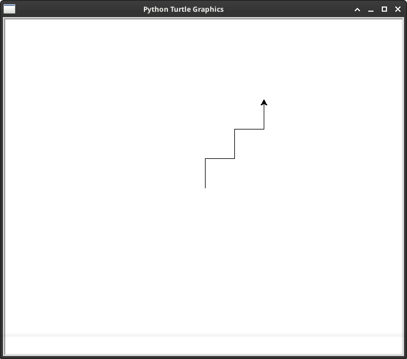
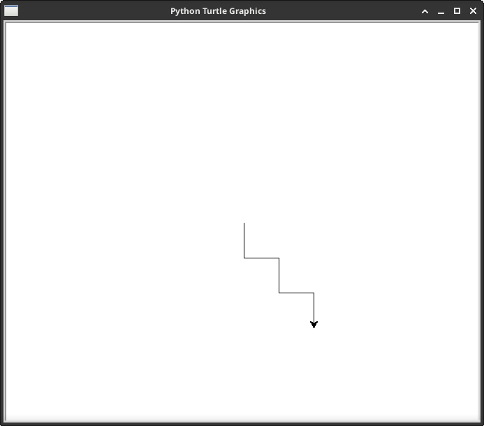
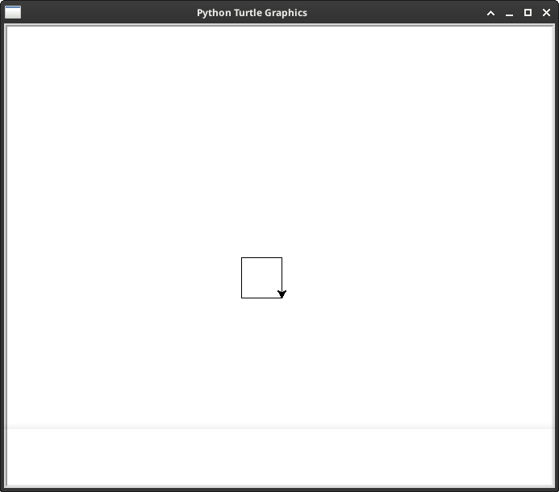
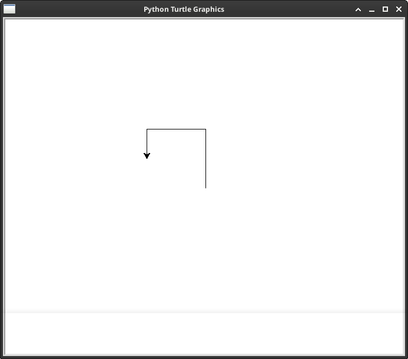
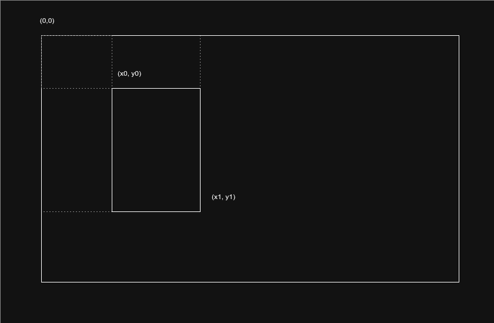

<!-- markdownlint-disable MD033 -->

# Universidad Sergio Arboleda

## Examen Parcial 2 - Algoritmia y Scripting

---

Fecha: Lunes 20 de Abril de 2026

Nombre Completo: **Escriba su nombre aquí**

---

### Instrucciones del parcial

El siguiente parcial consta de dos partes: cuatro ejercicios de selección múltiple con única respuesta y dos ejercicios prácticos.

Los ejercicios de selección múltiple se responden seleccionando la respuesta que considere más conviente. Para seleccionar una respuesta basta con escribir una `X` dentro de los corchetes que marcan la opción. Observe el siguiente ejemplo donde se ha seleccionado la opción 4.

```markdown
- [ ] Opción 1.
- [ ] Opción 2.
- [ ] Opción 3.
- [X] Opción 4.
```

Los ejercicios prácticos se responden modificando (normalmente agregando) lineas de códigos después del comentario `# TODO: Escriba su código aqui`. Por ejemplo, si se tiene una expresión como la siguiente:

```python
def suma(a, b):
    # TODO: Escriba su codigo aqui
    pass
```

Para para responder esta pregunta hay que modificar las lineas bajo el comentario tal como se indica en el siguiente bloque de código.

```python
def suma(a, b):
    return a + b
```

Adicionalmente, se tiene un archivo de pruebas que puede utilizarse para verificar el funcionamiento correcto de la funcion. El archivo auxiliar inicia con la palabra `test_` y para ejecutarlo se utiliza la expersión:

```bash
python -m unittest test_suma.py
```

---

<div style="page-break-after: always;"></div>

### Pregunta 1 (5 puntos)

¿Cuál es la salida esperada del siguiente código en python?

```python
def funcion_a():
    print('c')


def funcion_b():
    print('a')


def funcion_c():
    print('b')


funcion_b()
funcion_a()
funcion_c()
```

- [ ] Opcion 1:

```plain
a
b
c
```

- [ ] Opcion 2:

```plain
b
c
a
```

- [ ] Opcion 3:

```plain
a
c
b
```

- [ ] Opcion 4:

```plain
b
a
c
```

### Pregunta 2 (5 Puntos)

¿Qué figura muestra el siguiente código de **python-turtle**?

```python
import turtle

t = turtle.Turtle()

for i in range(5):
    if i % 2 == 0:
        t.left(90)
    else:
        t.right(90)
    t.forward(50)

turtle.done()
```

| Opcion 1                                      | Opcion 2                                      |
|-----------------------------------------------|-----------------------------------------------|
|  |  |

| Opcion 3                                      | Opcion 4                                      |
|-----------------------------------------------|-----------------------------------------------|
|  |  |

- [ ] Opción 1
- [ ] Opción 2
- [ ] Opción 3
- [ ] Opción 4

### Pregunta 3 (5 puntos)

Observa el siguiente bloque de código.

```python
from math import pi

def area_circulo(radio):
    """
    Calcula el área de un círculo dado su radio.
    Args:
        radio (float): El radio del círculo.
    Returns:
        float: El área del círculo (π * radio²).
    """
    # TODO: Modifica solo la linea que contiene la palabra return
    return 
```

¿Con cuál de las siguientes opciones se debe reemplazar la última linea para el código funcione?

- [ ] `return radio ^ 2 * pi`
- [ ] `return radio * 2 ** pi`
- [ ] `return radio ** 2 * pi`
- [ ] `return radio ** 2 + pi`

### Pregunta 4 (5 Puntos)

¿Cuál es la salida esperada del siguiente código en python?

```python
def fibbo(n):
    if n == 0:
        return 1
    if n == 1: 
        return 1
    return fibbo(n - 1) + fibbo(n - 2)

print(fibbo(4))
```

- [ ] `3`
- [ ] `5`
- [ ] `8`
- [ ] `13`

---

<div style="page-break-after: always;"></div>

### Ejercicio 1 (30 puntos)

Modifica el archivo `cuadrado_ascii.py`. Escriba una función que muestre en la consola un cuadrado, alineado al margen izquierdo de la pantalla. La función debe recibir un parámetro entero `lado` que especifica el número de símbolos por lado del cuadrado. También debe recibir un parámetro string `símbolo` que determine el símbolo que será usado, así como otro parámetro llamado `separador` que separa los símbolos del cuadrado (por defecto vacío).

**Ejemplos:**

- Para `lado = 3`, `símbolo = "*"`, `separador = ""`:

```plain
***
***
***
```

- Para `lado = 3`, `símbolo = "#"`, `separador = ""`:

```plain
###
###
###
```

- Para `lado = 3`, `símbolo = "*"`, `separador = " "`:

```plain
* * *
* * *
* * *
```

- Para `lado = 4`, `símbolo = "+"`, `separador = ""`:

```plain
++++
++++
++++
++++
```

- Para `lado = 1`, `símbolo = "X"`, `separador = ""`:

```plain
X
```

- Para `lado = 0` o valores negativos, la función no debe mostrar nada (cuadrado vacío).

Adaptado del ejercicio **6.23** de libro *C++ ¿Cómo programar?*, Deitel. Sexta edición. Pearson education. 2008.

<div style="page-break-after: always;"></div>

### Ejercicio 2 (50 puntos)

Toma como referencia el sistema de coordenadas de la siguiente figura:



Nota que el origen `(0, 0)` se encuentra en la esquina superior izquierda.

Teniendo como referencia esto modifica el archivo `rectangulo.py` y realiza cada una de los sigueintes tareas:

1. Cree una clase **Rectangulo** con los atributos enteros `x0`, `y0`, `x1` y `y1`. Esta función debe tener las siguientes validaciones:
   1. En caso que `x0` sea mayor a `x1`. Se arrojará un error de tipo `ValueError` con el mensaje `x0 debe ser menor o igual a x1`.
   2. En caso que `y0` sea mayor a `y1`. Se arrojará un error de tipo `ValueError` con el mensaje `y0 debe ser menor o igual a y1`.

2. `x0` y `y0` tienen un valor predeterminado de `0`.

3. `x1` y `y1` tienen un valor predeterminado de `0`.

4. Construye métodos `alto` y `ancho` que retornen la altura y el ancho del rectángulo respectivamente.

5. Proporcione métodos `perimetro` y `area` que calculen el perimetro y el area respectivamente.

6. Construye un métodos llamado  `es_cuadrado` que retorne una variable tipo `bool` indicando si el rectángulo es un cuadrado.

7. Construye un método llamado `desplazar` que tome dos parámetros `dx` y `dy` y mueva el rectángulo, `dx` unidades a la derecha o a la izquierda en caso que `dx` sea negativo. Anaálogamente, el rectángulo debe moverse `dy` unidades hacia arriba o hacia abajo dependiendo si el valor de `dy` es negativo o positivo respectivamente.

Adaptado de los ejercicios **9.11**, **9.12** y **9.13** de libro *C++ ¿Cómo programar?*, Deitel. Sexta edición. Pearson education. 2008.

---

### Bonus (20 puntos)

Modifica el archivo `rectangulo_ascii.py`. Implementa una función `draw_rectangle()` que acepte los parámetros `alto_canvas`, `ancho_canvas`, `rectangulo` y `simbolo`. Esta función debe generar una representación visual del rectángulo dibujado en un canvas (lienzo) de tamaño `alto_canvas` x `ancho_canvas`.

**Comportamiento esperado:**

- La función debe retornar una cadena que representa el canvas.
- El canvas debe tener dimensiones de `alto_canvas` filas por `ancho_canvas` columnas.
- Las celdas dentro del rectángulo deben rellenarse con el símbolo especificado.
- Las celdas fuera del rectángulo pueden llenarse con espacios en blanco o un símbolo diferente.

**Ejemplo:**
Si tenemos un canvas de 5x10, un rectángulo `Rectangulo(2, 1, 6, 3)` y símbolo `"#"`, el resultado podría ser:

```plain
          
  ####    
  ####    
          
          
```

Donde la primera fila es y=0, y la primera columna es x=0.

Adaptado de los ejercicios **9.11**, **9.12** y **9.13** de libro *C++ ¿Cómo programar?*, Deitel. Sexta edición. Pearson education. 2008.

---

```python
print("¡Mucha suerte!")
```
