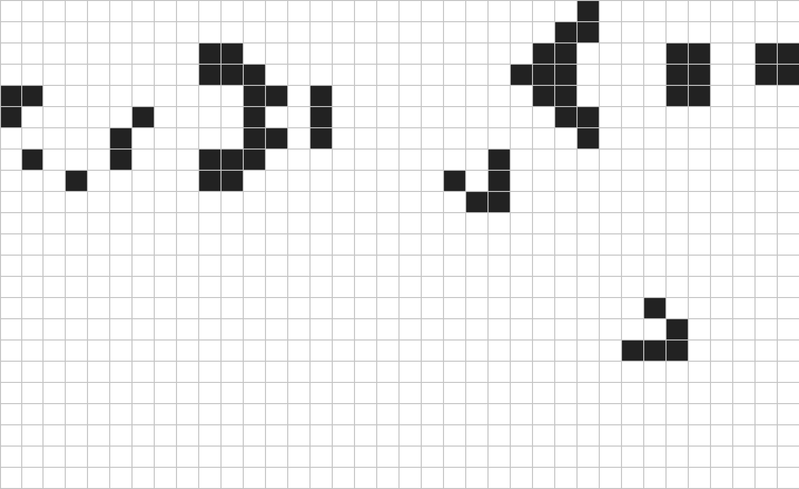
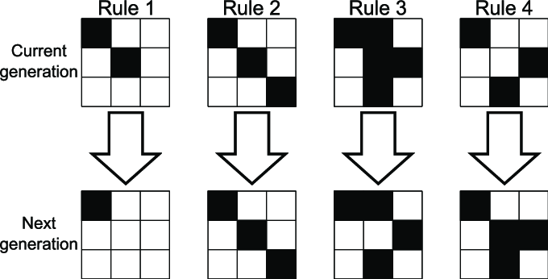
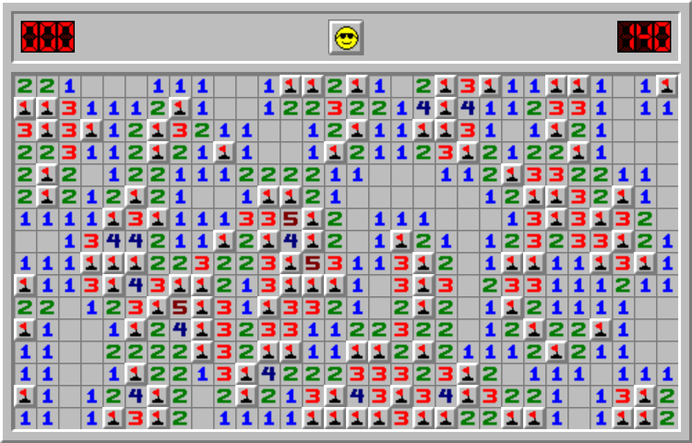
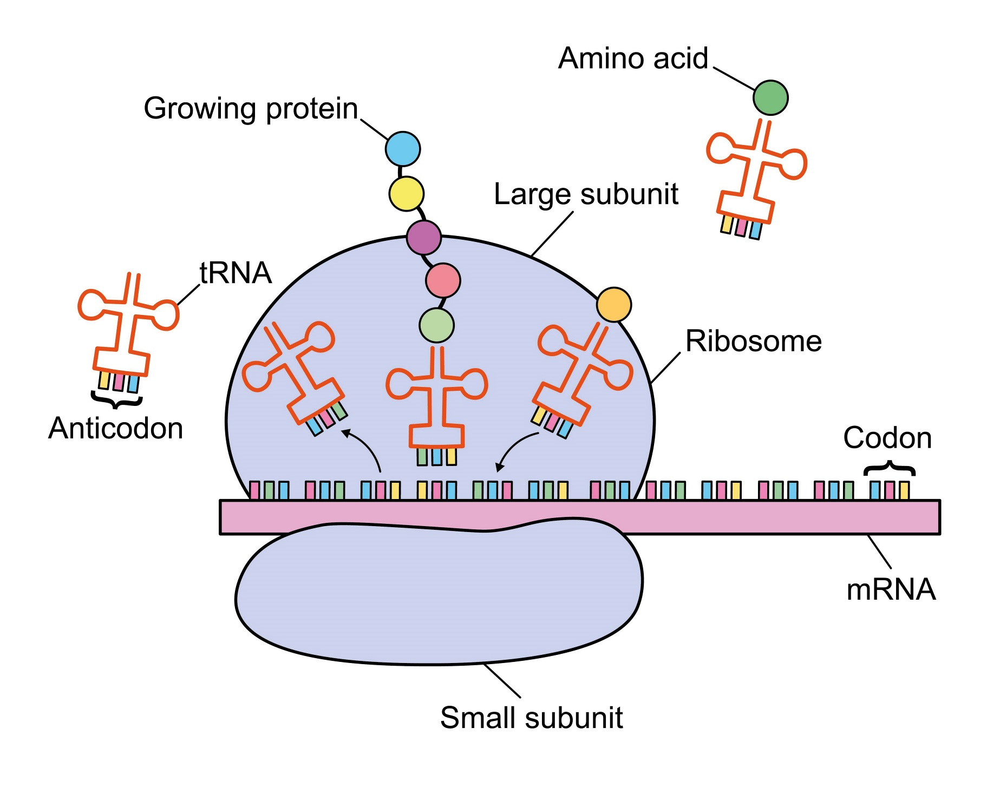

<!-- markdownlint-disable MD033 -->

# Universidad Sergio Arboleda

## Examen Parcial 3 - Algoritmia y Scripting

---

Fecha: Lunes 25 de Mayo de 2026

Nombre Completo: **Escriba su nombre aquí**

---

### Instrucciones del parcial

El siguiente parcial consta de dos partes: cuatro ejercicios de selección múltiple con única respuesta y dos ejercicios prácticos.

Los ejercicios de selección múltiple se responden seleccionando la respuesta que considere más conviente. Para seleccionar una respuesta basta con escribir una `X` dentro de los corchetes que marcan la opción. Observe el siguiente ejemplo donde se ha seleccionado la opción 4.

```markdown
- [ ] Opción 1.
- [ ] Opción 2.
- [ ] Opción 3.
- [X] Opción 4.
```

Los ejercicios prácticos se responden modificando (normalmente agregando) lineas de códigos después del comentario `# TODO: Escriba su código aqui`. Por ejemplo, si se tiene una expresión como la siguiente:

```python
def suma(a, b):
    # TODO: Escriba su codigo aqui
    pass
```

Para para responder esta pregunta hay que modificar las lineas bajo el comentario tal como se indica en el siguiente bloque de código.

```python
def suma(a, b):
    return a + b
```

Adicionalmente, se tiene un archivo de pruebas que puede utilizarse para verificar el funcionamiento correcto de la funcion. El archivo auxiliar inicia con la palabra `test_` y para ejecutarlo se utiliza la expersión:

```bash
python -m unittest test_suma.py
```

---

<div style="page-break-after: always;"></div>

## Pregunta 1 (5 puntos)

¿Qué tipo de error generan los siguientes códigos de python?

```python
lista_numeros = [2, 5, 6, 7, 6]
numero_final = lista_numeros[5]
```

```python
diccionario_palabras = {
    'a': 'abeja',
    'b': 'buitre',
    'c': 'camello',
}
palabra_con_d = diccionario_palabras['d']
```

- [ ] `ValueError` ambos.
- [ ] `IndexError` y `KeyError`, respectivamente.
- [ ] `IndexError` y `ValueError`, respectivamente.
- [ ] `IndexError` ambos.

## Pregunta 2 (5 puntos)

¿Qué método agrega un elemento al final de una lista en python?

- [ ] `append()`
- [ ] `add()`
- [ ] `insert()`
- [ ] `extend()`

## Pregunta 3 (5 puntos)

Sea la siguiente función en python:

```python
def foo(lista):
    item = lista.pop()
    lista.insert(0, item)
    return lista
```

Si la entrada de la función es la lista `[1, 2, 3, 4, 5]`, ¿Cuál es la salida de la función?

- [ ] `[1, 2, 3, 4, 5]`
- [ ] `[5, 1, 2, 3, 4]`
- [ ] `[1, 2, 3, 4]`
- [ ] `[5, 4, 3, 2, 1]`

<div style="page-break-after: always;"></div>

## Pregunta 4 (5 puntos)

¿Cuál es la salida esperada del siguiente código?

```python
a = [1, 2, 3]
a.append( [4, 5] )
print(a)
```

- [ ] `[1, 2, 3, 4, 5]`
- [ ] `[1, 2, 3, [4, 5]]`
- [ ] `[4, 5, 1, 2, 3]`
- [ ] `[1, 2, 3, 4, 5, 4, 5]`

## Pregunta 5 (5 puntos)

¿Cuál es la salida esperada del siguiente código?

```python
d = {"a": 1, "b": 2}
val = d.get("c", 3)
print(val)
```

- [ ] `2`
- [ ] `3`
- [ ] `KeyError`
- [ ] `None`

---

<div style="page-break-after: always;"></div>

## Pregunta 6: El Juego de la Vida de Conway (25 puntos)

Bienvenido al Juego de la Vida de Conway en la pista de Python de Exercism.
Si necesitas ayuda para ejecutar las pruebas o enviar tu código, consulta `HELP.md`.

### 6.1. Introducción

[El Juego de la Vida de Conway][game-of-life] es un autómata celular fascinante creado por el matemático británico John Horton Conway en 1970.

El juego consiste en una cuadrícula bidimensional de células que pueden estar "vivas" o "muertas".

Después de cada generación, las células interactúan con sus ocho vecinos a través de un conjunto de reglas, que definen la nueva generación.

[game-of-life]: https://en.wikipedia.org/wiki/Conway%27s_Game_of_Life



Imagen tomada de [datawrapper.de](https://www.datawrapper.de/blog/game-of-life)

### 6.2. Instrucciones

Después de cada generación, las células interactúan con sus ocho vecinos, que son células adyacentes horizontal, vertical o diagonalmente.

#### 🎯 Las Reglas

Para cada célula, cuentas sus **8 vecinos** (horizontal, vertical y diagonal):

- ❌ **Regla 1: Celula viva con menos de dos vecinos vivos** → muere
- ✅ **Regla 2: Célula viva con 2-3 vecinos vivos** → sobrevive
- ❌ **Regla 3: Celula viva más menos de tres vecinos vivos** → muere
- ✅ **Regla 4: Célula muerta con exactamente 3 vecinos vivos** → nace  



Imagen tomada de [researchgate.net](https://www.researchgate.net/figure/Rules-of-Conways-Game-of-Life_fig5_339605473)

### 6.3. ¿Qué hay que hacer?

Debes implementar la función `tick(matrix)` que simula **una generación** del Juego de la Vida de Conway. El código en game_of_life.py

Dada una matriz de 1s y 0s (correspondientes a células vivas y muertas), aplica las reglas a cada célula y devuelve la siguiente generación.

### 6.4. Ejemplos de Salida Esperada

#### Ejemplo 1: Célula solitaria (muere por soledad)

```python
matrix = [
    [0, 0, 0],
    [0, 1, 0],
    [0, 0, 0],
]
# ↓ Resultado después de tick:
[
    [0, 0, 0],
    [0, 0, 0],  # La célula del centro muere (0 vecinos vivos)
    [0, 0, 0],
]
```

#### Ejemplo 2: Dos células verticales (ambas mueren)

```python
matrix = [
    [0, 0, 0],
    [0, 1, 0],
    [0, 1, 0],
]
# ↓ Resultado:
[
    [0, 0, 0],
    [0, 0, 0],  # Ambas mueren (tienen solo 1 vecino vivo)
    [0, 0, 0],
]
```

#### Ejemplo 3: Patrón estable (3 esquinas vivas)

```python
matrix = [
    [1, 1, 0],
    [0, 0, 0],
    [1, 0, 0],
]
# ↓ Resultado:
[
    [0, 0, 0],
    [1, 1, 0],  # Nace una célula en [1,0] y [1,1] (3 vecinos vivos)
    [0, 0, 0],
]
```

#### Ejemplo 4: Matriz llena (explosiones)

```python
matrix = [
    [1, 1, 1],
    [1, 1, 1],
    [1, 1, 1],  # 9 células vivas
]
# ↓ Resultado (sobreviven solo las 4 esquinas):
[
    [1, 0, 1],  # Centro muere (4+ vecinos), esquinas sobreviven (3 vecinos)
    [0, 0, 0],  # Centro de cada lado muere (4+ vecinos)
    [1, 0, 1],
]
```

### 6.5. Verificar tu solución

El código ya está listo. Puedes ejecutar los tests con:

```bash
python -m pytest game_of_life_test.py
```

Los 8 tests validan diferentes escenarios de las reglas del juego. ✨

Made changes.

### 6.6 Fuente

#### 6.6.1. Tomado de

- [exercism.org](https://exercism.org/tracks/python/exercises/game-of-life)

#### 6.6.2. Creado por

- @BNAndras

#### 6.6.3. Basado en

Wikipedia - [https://en.wikipedia.org/wiki/Conway%27s_Game_of_Life](https://en.wikipedia.org/wiki/Conway%27s_Game_of_Life)

---

<div style="page-break-after: always;"></div>

## Pregunta 7: Buscaminas (25 puntos)

Bienvenido a Buscaminas en la pista de Python de Exercism.
Si necesitas ayuda para ejecutar las pruebas o enviar tu código, consulta `HELP.md`.

### 7.1. Introducción

[Buscaminas][wikipedia] es un juego popular donde el usuario tiene que encontrar las minas usando pistas numéricas que indican cuántas minas están directamente adyacentes (horizontal, vertical, diagonalmente) a un cuadrado.



[wikipedia]: https://en.wikipedia.org/wiki/Minesweeper_(video_game)

### 7.2. Instrucciones

Tu tarea es agregar los conteos de minas a los cuadrados vacíos en un tablero de Buscaminas completado.
El tablero es un rectángulo compuesto de cuadrados que son vacíos (`' '`) o minas (`'*'`).

Para cada cuadrado vacío, cuenta el número de minas adyacentes (horizontal, vertical, diagonalmente).
Si el cuadrado vacío no tiene minas adyacentes, déjalo vacío.
De lo contrario, reemplázalo con el conteo de minas adyacentes.

Por ejemplo, puedes recibir un tablero de 5 x 4 como este (los espacios vacíos se representan aquí con el carácter '·' para mostrar en pantalla):

```text
·*·*·
··*··
··*··
·····
```

Que tu código debería transformar en esto:

```text
1*3*1
13*31
·2*2·
·111·
```

### 7.3. Ejemplos adicionales

Basándonos en los casos de prueba, aquí hay algunos ejemplos con explicaciones:

1. **Mina rodeada de espacios**:
   - Entrada: `["   ", " * ", "   "]`
   - Salida: `["111", "1*1", "111"]`
   - Explicación: La mina en el centro tiene 8 espacios adyacentes. Cada espacio cuenta 1 mina adyacente (la del centro), por lo que se convierten en '1'. La mina permanece como '*'.

2. **Espacio rodeado de minas**:
   - Entrada: `["***", "* *", "***"]`
   - Salida: `["***", "*8*", "***"]`
   - Explicación: El espacio en el centro tiene 8 minas adyacentes (todas las posiciones alrededor), por lo que se reemplaza con '8'. Las minas permanecen como '*'.

3. **Línea horizontal**:
   - Entrada: `[" * * "]`
   - Salida: `["1*2*1"]`
   - Explicación: Los espacios a los lados de cada mina cuentan 1 mina adyacente. El espacio entre las dos minas cuenta 2 minas adyacentes (ambas).

4. **Línea vertical**:
   - Entrada: `[" ", "*", " ", "*", " "]`
   - Salida: `["1", "*", "2", "*", "1"]`
   - Explicación: Los espacios arriba y abajo de cada mina cuentan 1 mina adyacente. El espacio entre las dos minas cuenta 2 minas adyacentes.

5. **Sin minas**:
   - Entrada: `["   ", "   ", "   "]`
   - Salida: `["   ", "   ", "   "]`
   - Explicación: No hay minas, por lo que todos los espacios permanecen vacíos.

6. **Solo minas**:
   - Entrada: `["***", "***", "***"]`
   - Salida: `["***", "***", "***"]`
   - Explicación: No hay espacios vacíos para contar, por lo que el tablero permanece igual.

### 7.4. Mensajes de excepción

A veces es necesario [lanzar una excepción](https://docs.python.org/3/tutorial/errors.html#raising-exceptions). Cuando lo hagas, siempre incluye un **mensaje de error significativo** para indicar cuál es la fuente del error. Esto hace que tu código sea más legible y ayuda significativamente con la depuración. Para situaciones donde sabes que la fuente del error será de cierto tipo, puedes elegir lanzar uno de los [tipos de error incorporados](https://docs.python.org/3/library/exceptions.html#base-classes), pero aún así incluye un mensaje significativo.

Este ejercicio en particular requiere que uses la [sentencia raise](https://docs.python.org/3/reference/simple_stmts.html#the-raise-statement) para "lanzar" un `ValueError` cuando la función `board()` recibe entrada malformada. Las pruebas solo pasarán si lanzas la excepción e incluyes un mensaje con ella.

Para lanzar un `ValueError` con un mensaje, escribe el mensaje como argumento al tipo de excepción:

```python
# cuando el tablero recibe entrada malformada
raise ValueError("The board is invalid with current input.")
```

### 7.5. Fuente

#### 7.5.1. Tomado de

- [exercism.org](https://exercism.org/tracks/python/exercises/minesweeper)

#### 7.5.2. Creado por

- @betegelse

#### 7.5.3. Contribuido por

- @alexpjohnson
- @behrtam
- @BethanyG
- @cmccandless
- @Dog
- @fluxusfrequency
- @ikhadykin
- @kytrinyx
- @N-Parsons
- @peterblazejewicz
- @pheanex
- @sjakobi
- @smalley
- @tqa236

---

<div style="page-break-after: always;"></div>

## Pregunta 8: Traducción de Proteínas (25 puntos)

Bienvenido a Traducción de Proteínas en la pista de Python de Exercism.
Si necesitas ayuda para ejecutar las pruebas o enviar tu código, consulta `HELP.md`.



### 8.1. Instrucciones

Traduce secuencias de ARN en proteínas.

El ARN se puede dividir en secuencias de tres nucleótidos llamadas codones, y cada codón se traduce en un aminoácido.
Por ejemplo:

ARN: `"AUGUUUUCU"` => se traduce en

Codones: `"AUG", "UUU", "UCU"`
=> que se convierten en la secuencia de proteínas =>

Proteína: `"Methionine", "Phenylalanine", "Serine"`

Hay 64 codones que corresponden a 20 aminoácidos; sin embargo, no es necesario manejar todos los codones de forma explícita para este ejercicio.
Si tu solución funciona para un codón, debería funcionar para todos los que aparecen en esta lista.

También existen tres codones de terminación (codones 'STOP'); si se encuentra alguno de estos codones, la traducción termina y todas las secuencias posteriores se ignoran.

Por ejemplo:

ARN: `"AUGUUUUCUUAAAUG"` =>

Codones: `"AUG", "UUU", "UCU", "UAA", "AUG"` =>

Proteína: `"Methionine", "Phenylalanine", "Serine"`

Ten en cuenta que el codón de parada `"UAA"` detiene la traducción y el último codón `"AUG"` no se traduce.

### 8.2. Codones y aminoácidos necesarios

| Codón               | Aminoácido     |
| :------------------ | :------------- |
| AUG                 | Methionine     |
| UUU, UUC            | Phenylalanine  |
| UUA, UUG            | Leucine        |
| UCU, UCC, UCA, UCG  | Serine         |
| UAU, UAC            | Tyrosine       |
| UGU, UGC            | Cysteine       |
| UGG                 | Tryptophan     |
| UAA, UAG, UGA       | STOP           |

### 8.3. Ejemplos basados en los tests

1. **Un codón que no es STOP**:
   - Entrada: `"AUG"`
   - Salida: `["Methionine"]`
   - Explicación: "AUG" se mapea a Methionine.

2. **Dos codones iguales**:
   - Entrada: `"UUUUUU"`
   - Salida: `["Phenylalanine", "Phenylalanine"]`
   - Explicación: Se divide en `"UUU"`, `"UUU"`; cada codón es Phenylalanine.

3. **Dos codones distintos**:
   - Entrada: `"UUAUUG"`
   - Salida: `["Leucine", "Leucine"]`
   - Explicación: Se divide en `"UUA"`, `"UUG"`; ambos codones son Leucine.

4. **Secuencia con STOP al principio**:
   - Entrada: `"UAGUGG"`
   - Salida: `[]`
   - Explicación: El primer codón es STOP (`"UAG"`), así que no se traduce nada.

5. **STOP al final de una secuencia**:
   - Entrada: `"UGGUAG"`
   - Salida: `["Tryptophan"]`
   - Explicación: `"UGG"` es Tryptophan y `"UAG"` detiene la traducción.

6. **STOP en medio de la secuencia**:
   - Entrada: `"AUGUUUUAA"`
   - Salida: `["Methionine", "Phenylalanine"]`
   - Explicación: `"AUG"` => Methionine, `"UUU"` => Phenylalanine, y `"UAA"` detiene la traducción.

7. **Secuencia larga que se detiene en STOP**:
   - Entrada: `"UGGUGUUAUUAAUGGUUU"`
   - Salida: `["Tryptophan", "Cysteine", "Tyrosine"]`
   - Explicación: Se toman los codones `"UGG"`, `"UGU"`, `"UAU"`, `"UAA"`; luego de `"UAA"` no se traducen más codones.

### 8.4. Fuente

#### 8.4.1. Tomado de

- [exercism.org](https://exercism.org/tracks/python/exercises/protein-translation)

#### 8.4.2. Creado por

- @cptjackson

#### 8.4.3. Contribuido por

- @behrtam
- @cmccandless
- @Dog
- @ikhadykin
- @N-Parsons
- @nmbrgts
- @sjwarner-bp
- @thomasjpfan
- @tqa236
- @yawpitch

#### 8.4.4. Basado en

Tyler Long

---

<div style="page-break-after: always;"></div>

```python
print("Fin del examen")
print("Gracias por ser parte de este curso".)
```
